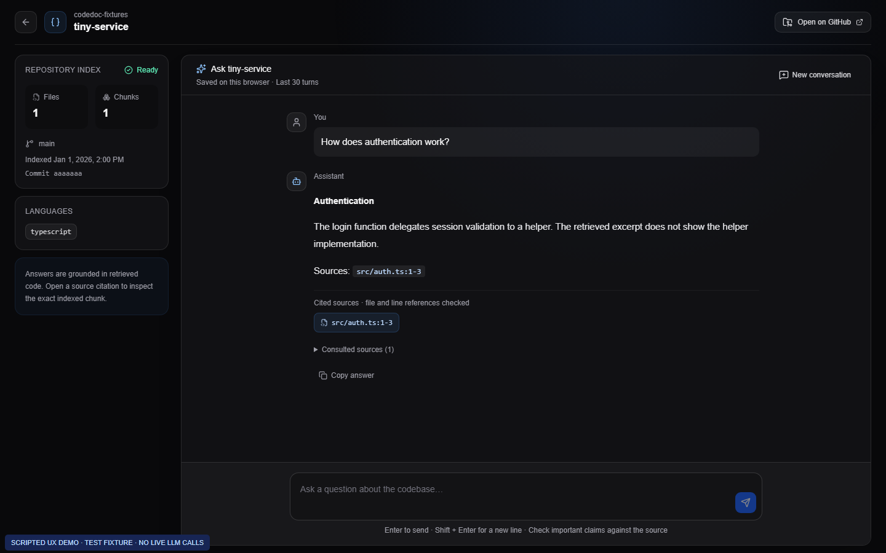

# Code Documentation Assistant

Understand a public GitHub codebase through conversation. Clone and index source code, ask questions, and inspect the exact indexed chunks behind file/line references.

A local-first take-home project: one Next.js application, PostgreSQL/pgvector, and an explicit RAG pipeline. No authentication, agents, queues, Redis, or LangChain.

## Why I built it this way

I chose the Code Documentation Assistant because understanding an unfamiliar repository is a concrete use case for retrieval: an explanation is more useful when I can open the code behind it. I wanted the application to make that verification easy, not just produce a plausible summary.

I specified a single Next.js/TypeScript application so the UI and server endpoints could stay in one codebase. PostgreSQL stores the repository metadata and chunks, and pgvector adds similarity search without another database service. I kept orchestration in ordinary TypeScript rather than adding LangChain, so I can follow and explain each step of the pipeline. I worked incrementally: a runnable foundation first, then ingestion and Q&A, followed by usability and reliability improvements.

## Preview



[Home](docs/screenshots/home.png) · [Mobile](docs/screenshots/mobile.png) · [Source preview](docs/screenshots/source-preview.png) · [Short UX video](docs/demo/ux-walkthrough.webm)

These artifacts are **labelled, scripted UX demonstrations** against an isolated test fixture. Answers are intercepted in the browser test; they are not evidence of a live LLM quality evaluation. The application itself never synthesizes analysis results. See [demo instructions](docs/DEMO.md).

## Quick start

Prerequisites: **Node.js 22.12+**, npm, Git, Docker Desktop with Linux containers, and an OpenAI API key for real indexing/Q&A. Tested locally with Node 22.

```bash
npm ci
# Create .env only if it does not already exist:
test -f .env || cp .env.example .env
docker compose up -d
npm run db:generate
npm run db:deploy
npm run dev
```

On PowerShell, replace the environment-copy command with:

```powershell
if (!(Test-Path .env)) { Copy-Item .env.example .env }
```

Add your own `OPENAI_API_KEY` to `.env`; never commit it. Open [localhost:3000](http://localhost:3000).

PostgreSQL listens on **localhost:5433**, avoiding a common conflict with a native PostgreSQL installation on 5432. The example connection string matches Compose. Docker volumes preserve the index across restarts; do not use `docker compose down -v` unless you intend to erase the local database.

For an existing checkout, run `npm ci`, `npm run db:generate` and `npm run db:deploy` after pulling migrations. On Windows, stop this project's dev server before Prisma generation if its DLL is locked, then restart it. Migrations add metadata without dropping existing chunks. A case-insensitive repository URL index deliberately rejects pre-existing duplicate URLs rather than discarding data.

Production-mode local check: `npm run build`, then `npm start` (stop dev first if using the same port).

## Environment

| Variable                  | Required | Purpose                                                         |
| ------------------------- | -------- | --------------------------------------------------------------- |
| `DATABASE_URL`            | Yes      | PostgreSQL connection string (`postgresql://` or `postgres://`) |
| `OPENAI_API_KEY`          | Yes      | Server-side provider key; real calls are billable               |
| `OPENAI_CHAT_MODEL`       | No       | Defaults to `gpt-4.1-mini`                                      |
| `OPENAI_EMBEDDING_MODEL`  | No       | Defaults to `text-embedding-3-small`                            |
| `REPOSITORY_STORAGE_PATH` | No       | Temporary clone root; defaults to `.data/repositories`          |

Zod validates configuration at server infrastructure initialization. No secrets are exposed as `NEXT_PUBLIC_*`. Models are configured centrally in `src/config/ai.ts`. Vector dimensions are fixed at 1,536 in both configuration and the SQL schema; changing dimensions requires a migration and reindexing. Changing the embedding model or index signature also requires reindexing; equal dimensions alone do not make embeddings comparable.

## Using the application

1. Enter a public GitHub URL. Clone, scan, chunk, embed, and save stages report actual counters, without simulated percentages.
2. Open any recent repository without reindexing. “Check for updates” fills its URL; analyzing again reuses an index only when its commit and configuration match.
3. Ask a question. “Cited sources” contains references that were checked against the model's actual context. “Consulted sources” is the larger retrieved set, not a list of proven supporting references.
4. Open a source to inspect code and highlighted lines, copy an answer, or retry a failed question with its original history.
5. The last 30 turns are saved **on this browser**, per repository, within a bounded storage budget. “New conversation” asks for confirmation. A new index revision invalidates stale history/source IDs. There is no cross-device synchronization or multi-tab merge.

## Stack and architecture

Next.js 16 / React 19 / strict TypeScript / App Router; Tailwind 4 and a small shadcn/ui set; Prisma 6; PostgreSQL 17 with pgvector; OpenAI Node SDK; Zod; simple-git; fast-glob. Vitest and Playwright cover logic, API boundaries, database concurrency, and browser workflows.

```text
Browser
  ├─ Analyze URL → API → DB lease → shallow Git clone
  │                 → scan/filter → line chunks → embeddings
  │                 → fenced transaction → PostgreSQL + pgvector
  ├─ Progress / recent repositories ← safe database metadata
  └─ Question + bounded history → embedding → repository-scoped retrieval
                    → bounded, numbered context → structured LLM answer
                    → validate source IDs and line ranges → Markdown + source preview
```

```text
src/app/             pages and HTTP routes
src/components/      UI and source dialog
src/config/          validated environment and model settings
src/lib/api/         request validation and safe errors
src/lib/chat/        browser persistence and retry/history logic
src/lib/db/          Prisma and atomic vector-index replacement
src/lib/github/      URL validation and cloning
src/lib/ingestion/   leases, progress, scanning, chunking, index signatures
src/lib/rag/         embeddings, retrieval, context, citation verification
src/lib/llm/         SDK client, prompt, structured answer schema
prisma/              relational schema and SQL migrations
tests/               unit/API/database tests
e2e/                 browser tests and opt-in demo capture
docs/                screenshots, demo, quality and test notes
```

## RAG/LLM approach and trade-offs

I kept the pipeline explicit and bounded so its behavior and failure modes are inspectable. These choices are implementation trade-offs, not a claim of benchmarked superiority.

- **Explicit orchestration:** ordinary TypeScript functions expose each pipeline boundary without another orchestration framework.
- **Chunking:** overlapping line windows (120 lines, 20 overlap), character bounds, path/language/line metadata. It is language-agnostic, not AST-aware; symbols are optional and currently not extracted. Long-line fragments retain their original line number.
- **Retrieval:** repository-scoped cosine nearest-neighbor search, top eight chunks. The current implementation uses exact search, without a tuned ANN index, hybrid keyword search, or reranker.
- **Context:** at most 48,000 serialized characters, up to 12,000 content characters per chunk. Truncation happens at line boundaries and adjusts the visible end line. The last six conversation messages are bounded; only recent user questions influence the retrieval query.
- **Generation:** Responses API with a Zod-defined structured schema, `store: false`, and a bounded output. Model source IDs are resolved to server-owned paths. Each section needs an in-range citation; invalid/missing citations reject the generated answer. Refusals and incomplete outputs receive explicit error handling. This follows the [official Structured Outputs pattern](https://developers.openai.com/api/docs/guides/structured-outputs).
- **Abstention:** no usable context or an insufficient-context response produces a cautious answer. Nearest neighbors are not automatically relevant, and no universal score threshold is claimed.
- **Guardrails:** GitHub HTTPS URL allowlist, no cached developer Git credentials for clones, ignored dependencies/build output, no followed symlinks, no source execution, source treated as untrusted prompt data, server-side secrets, repository-scoped source lookup, no raw HTML/remote images in answers. Prompt instructions reduce risk; they are not proof against prompt injection.
- **Reference validity is not factual accuracy:** a cited file/range can exist while the explanation is wrong. Read the code and evaluate answer quality separately. See [quality notes](docs/QUALITY.md).

## Reliability, limits, and cost

An atomic database lease admits one indexing worker per repository, including case variants of its GitHub URL. The lease expires after five minutes and renews every 20 seconds while the process is alive. Fencing checks the owner inside the index-replacement transaction; a stale worker cannot replace the index. Failed reindexing preserves the last successful chunks. A failed first analysis remains retryable.

My main operational compromise is keeping ingestion inside a long HTTP request. This is manageable for a local take-home, but it is not durable execution: a restart interrupts the work. I would introduce background jobs when deployment constraints require them; the current lease is a concurrency safeguard, not a substitute for a queue or crash recovery.

The recorded commit SHA and a hash of embedding/chunking/filter configuration avoid regenerating unchanged indexes. A changed commit currently rebuilds the whole index; per-file embedding reuse is not implemented. Checking for updates still requires a shallow clone.

Limits: 1,000 supported files; 512 KB per file; 25 MB source; 5,000 chunks; embeddings in batches of 32. File/character limits are not an exact token/currency budget. Dense code or a single unusual long line may exceed a provider token limit and fail safely; no silent truncation is applied to embedding inputs.

JSON logs include stage durations, IDs, counts and actual provider token usage when available. Missing usage is recorded as unknown, not an invented estimate. Prompts, source content, API keys and raw exceptions are not logged. There is no durable usage ledger or dollar estimator. Failed requests and user retries may still incur provider charges; configure project spending limits separately.

## Quality checks

```bash
npm run lint
npm run typecheck
npm test
npm run format:check
npm run build
```

`npm run typecheck` generates Next.js route types before running TypeScript, so it also works in a fresh checkout before the first build. `npm run format` applies formatting. `npm run test:watch` watches unit tests. Tests disable live fetch calls and replace provider responses explicitly. The PostgreSQL integration test is opt-in with `TEST_DATABASE_URL`; it uses only an isolated test database.

[Testing instructions](docs/TESTING.md) cover database integration, Playwright and demo regeneration. GitHub Actions runs lint/typecheck/unit tests/format/build, plus an isolated pgvector service and browser/database tests. No GitHub OpenAI secret is needed. Check the [workflow runs](https://github.com/LupsaLaurentiu/CodeDocAssistant/actions/workflows/ci.yml) for the result of a particular commit; local checks and remote CI are separate evidence.

## Productionisation proposal — AWS

I would use the following approach to deploy on AWS. This is a deployment plan, **not an implemented or deployed environment**.

- Package the Next.js Node server plus Git into a non-root container, publish it to ECR, and run it on ECS/Fargate behind HTTPS. Provide bounded writable scratch storage for clones; Fargate supports [task ephemeral storage](https://docs.aws.amazon.com/AmazonECS/latest/developerguide/fargate-task-storage.html).
- Use private-network RDS PostgreSQL with an appropriate pgvector extension version, migrations, backups and restore drills. Confirm supported versions/region availability against the [RDS PostgreSQL release notes](https://docs.aws.amazon.com/AmazonRDS/latest/PostgreSQLReleaseNotes/postgresql-versions.html).
- Put runtime secrets in a managed secret store, use least-privilege roles and restricted network access, configure timeouts, pool limits, health checks, alerts and log retention.
- Before public access, add identity/authorization or a protected demo gateway, request/rate/body limits and abuse/cost controls. Repository scoping is **not user authorization**. This version has no accounts by design.
- Isolate untrusted cloning, enforce download/disk/time limits before and during the clone, and disable inherited Git configuration that could rewrite URLs or run filters.
- Replace the long HTTP ingestion request with durable job execution and explicit cancellation/recovery when moving beyond a local demo. A lease prevents concurrent writers but is not a job queue or crash-resume mechanism.

Only the database is containerized today. An application image, cloud resources and deployment automation remain work before production; no Kubernetes or microservice split is needed for the take-home.

## Engineering standards and known gaps

I prioritized strict types, Zod boundaries, focused modules, parameterized SQL, transactional writes, deterministic mocks, real database concurrency checks, accessible controls/focus behavior, responsive browser tests, formatting and CI configuration.

Deliberately not implemented: authentication/billing, private-repository credentials, durable jobs, streamed responses, semantic chunking, complete repository-wide search guarantees, multi-user conversation storage, full tracing/metrics backend, load testing or a paid live-LLM accuracy benchmark. Cloning limits are weaker than post-clone scanning limits. A process killed during cloning can leave temporary files requiring operational cleanup.

## How I used AI during development

I used Codex extensively for scaffolding, implementation, focused reviews, tests, debugging and documentation, including assistance with this README. I set the stack and scope, asked for incremental milestones and supplied feedback from using the application. I did not write every implementation detail manually.

For example, I tried the application against my DailyLove repository, asked for an architecture explanation and reported a Romanian follow-up that was rejected by request validation. I also shared screenshots showing double scrolling and a difficult-to-reach chat composer. Those observations guided subsequent validation and layout changes.

During the implementation sessions, Codex ran lint, typechecking, formatting, production builds, isolated PostgreSQL integration tests and browser tests. I distinguish those automated checks from my own manual feedback: they check defined behavior, but they do not establish live-model accuracy or prove that an explanation is supported by its citations. The screenshots and video use a labelled fixture with mocked provider responses, not a live-model benchmark.

## What I would do next

My first quality improvement would be a small labelled evaluation set with expected files and line ranges, including Romanian follow-ups, ambiguous questions and missing functionality. I would use the results to decide whether hybrid retrieval or syntax-aware chunks actually improve this application, rather than add them on assumption. A paid live-model evaluation has not been completed.

For a hosted version, I would prioritize access controls, stronger cloning isolation and durable indexing before opening the running application to public traffic. Public source code is not the same as a production-ready public service.

The [public repository](https://github.com/LupsaLaurentiu/CodeDocAssistant) includes the README, screenshots and scripted demo, so evaluators do not need a collaborator invitation. The [submission checklist and development notes](docs/AUTHOR_REVIEW.md) track delivery status. I keep the personal submission link outside Git; submitting the assignment remains a separate, manual action.
